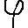
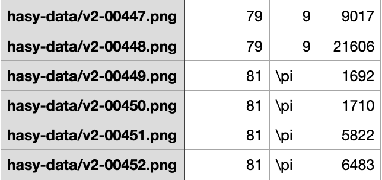
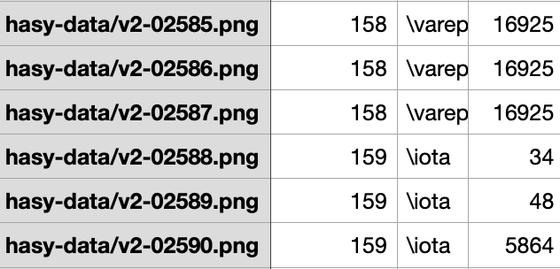

# handwritten-mathematical-symbols
Identifying handwritten mathematical symbols deep neural networks and convolution

Link of dataset:
  https://www.kaggle.com/guru001/hasyv2
(143 MB)

Context
HASYv2 - Handwritten Symbol database

Content
HASY contains 32px x 32px images of 369 symbol classes. In total, HASY contains over 150,000 instances of handwritten symbols.

This is basically a multiclass classification problem which I solved using CNN followed by Max pooling and dense layers.

*Folder and files arrangement*

Hand_written
  - handwritten_mathematical_model.ipynb
  - hasy-data
  - hasy-data-labels
  - symbols.csv
  - hasyv2
    - hasy-data
    - hasy-data-labels
    - symbols.csv
    - verification-task
   - verification-task

**Sample Images**

**Sample Labels**

